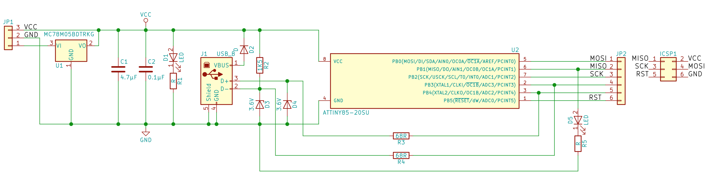

# A USB AVR programmer based on the vusbtiny project

VUSBtiny is a small in-system programmer (ISP) for Atmel AVR microcontrollers. It allows you to program microcontrollers on the go, without carrying a big programmer with you.

VUSBtiny is based on the [USBtinyISP](https://learn.adafruit.com/usbtinyisp). It uses an Atmel AVR microcontroller running [V-USB](https://www.obdev.at/products/vusb/index.html), which allows it to communicate with your computer via a USB port.

I had a bunch of these "Digispark" devices. They are basically an ATtiny85 on a small circuit board with a USB connection. So having a Digispark means we can just use one of these instead of having to build our own circuit board (of the original usbtinyisp ISP).

We can conveniently use an Arduino as ISP to program the USBtiny firmware.  This solves a decade old problem of mine where I need a programmer to build a programmer.

# About
This work is not my own, I extended the good work done by [Gonçalo](https://github.com/goncalor/vusbtiny) . Where if you follow his README, in turn he extended the [USBtinyISP](https://learn.adafruit.com/usbtinyisp) by Adafruit.

I did spend an unusual amount of time troubleshooting a bad USB cable that was only had the 2 wires because it was some kind of battery charging only cable or some nonsense.
It should be labelled differently that it is just a power cable and not a USB cable.

Seriously. Never trust a USB cable unless you test it first.

And then I added some schematics and documentation as I figured thing out too. I don't have Eagle CAD. (Really does anyone anymore now that it is a subscription based service from Autodesk?). So I added some kicad schematics.

The digispark hardware has all that USB interface stuff and convenient solder pads for headers or wires to connect to the device to be progrmammed.

# License

VUSBtiny is licensed under [GNU GPL v2.0](http://choosealicense.com/licenses/gpl-2.0/). The license is in the file `LICENSE.txt`. The changes I made are released under the same license.

The V-USB driver is licensed under GNU GPL v2.0. If you intend to use V-USB commercially read [this page](https://www.obdev.at/products/vusb/license.html).

# Needed components
While I use a digispark for now, this is the reason I forked this repo in the first place,  I had the idea I might want to build a nice PCB later. So there are two options for now:
- Using a Digispark
- Discrete ATtiny build

## Using a Digispark
- A Digispark

At first I had thought I would make a small circuit board to implement the vusbtiny ISP. Which as we will see below, is just an attiny, some resistors, and some zener diodes. And as I was doing this it occurred to me, this schematic looks very familiar.

The original [digispark schematic](https://s3.amazonaws.com/digispark/DigisparkSchematicFinal.pdf) from their site was kind of terrible, so I drew it here:


The ones I have are called `GY Digispark kickstarter miniature minimal development board ATTINY85 module for Arduino usb` and are commonly found on AliExpress for about $2. Which really is about the cost to buy just the ATtiny85 device.


I like how it has the USB micro B connector instead of the PCB shaped like a USB A connector.

The only difference with the Digispark and the vusbtiny ISP schematic seems to be the pin 2, 3 to the attiny for the USB D+ and D- are switched.

That is easy to fix in the `usbconfig.h` by editing the pin definitions:
```
#define USB_CFG_DMINUS_BIT      3
#define USB_CFG_DPLUS_BIT       4
```
Where these are the IO port B bit numbers, that correspond to pins 2 and 3 respectively.

Really then just solder the 6 pin ICSP connector onto the digispark.


## A Discrete ATtiny build
To assemble your own VUSBtiny you will need the following components:

- an Atmel AVR microcontroller [compatible with V-USB](https://www.obdev.at/products/vusb/index.html). I suggest ATtiny45 or ATtiny85
- one USB port (male and type A)
- two 68 Ω resistors
- one 1.5 kΩ resistor
- two 3.6 V Zener diodes
- a 10 μF capacitor (optional but recommended)
- a breadboard, perfboard or PCB to assemble the circuit.


This is the same schematic from the original vusbtiny. I just redrew it in Kicad. The project is in the pcb/kicad folder.


# How to flash the AVR

The following instructions teach you how you can flash the Atmel AVR you chose to be the brain of your VUSBtiny. I will assume you are using ATtiny45 or ATtiny85. The instructions should be very similar even if you are using others.

## With an Arduino Uno

1. Choose a microcontroller compatible with V-USB. You can read about the required specs [here](https://www.obdev.at/products/vusb/). You need at least a 2 kB flash and 128 B of RAM. If you don't want to use an external oscillator your microcontroller must have a 16.5 MHz internal RC oscillator.
1. [Setup your Arduino as an ATtiny programmer](http://highlowtech.org/?p=1695)
1. Program Arduino Uno with the "ArduinoISP" sketch. This step is done without the capacitor between the RESET and GND pins of the Arduino. After you upload the "ArduinoISP" sketch connect the capacitor, as described in the link above
1. Adjust the following options in the `makefile`:
    - `MCU=attiny85`, for example
    - possibly adjust `PROGRAMMER_MCU` also. For ATtiny85/45 this is not needed
    - `AVRDUDE_PROGRAMMERID=avrisp`
    - `AVRDUDE_PORT=/dev/ttyACM0` or to whatever port the Arduino Uno is connected to. You check which port to use by running `dmesg` right after you connect your Arduino. The last lines in the output should mention some `tty` port
    - `BAUD=19200`. This value must match the one in the `Serial.begin()` in the "ArduinoISP" example
    - change the fuses if needed (`FUSE_L` and `FUSE_H`)
1. Do `make`. The source should compile successfully
1. Do `make install`
1. Set the fuses (if needed). On ATtiny85/45 we need to disable the reset pin which will be used as a normal I/O pin, which means you will not be able to program this microcontroller anymore using the Arduino Uno. If you need to reverse this step you need a HVSP (High Voltage Serial Programmer).
    - the fuses differ from device to device. The `makefile` is prepared for ATtiny85/45. If you have another MCU search for a fuse calculator that can aid you setting the correct fuses
    - when you're ready run `make fuse`


# How to use your new programmer

The device should show up as a usb device with the name "USBtinyISP"
* on Linux, `lsusb`
* on Macos, `system_profiler SPUSBDataType`

Your newly made programmer will be seen as a USBtinyISP programmer. That means the options you give to `avrdude` will be the same as if you had a true USBtinyISP connected. Example (flashing a simple blink code):

	avrdude -c usbtiny -p t85 -U flash:w:blinkC.hex

You may have to run with `sudo`, or set correct options in your system.

# Troubleshooting

1. Checking if your device was recognised

	Little after you connect the VUSBtiny to your computer if you run `dmesg` you should see something like this:

		[27548.612082] usb 4-1.5: new low-speed USB device number 105 using ehci-pci
		[27548.639576] usb 4-1.5: New USB device found, idVendor=1781, idProduct=0c9f
		[27548.639587] usb 4-1.5: New USB device strings: Mfr=0, Product=2, SerialNumber=0
		[27548.639592] usb 4-1.5: Product: USBtinyISP

	If instead you see only error messages this means the VUSBtiny was not correctly recognised, so it will not work. Try reconnecting.

2. When programming with VUSBtiny `avrdude` throws `Operation not permitted` error

		avrdude -c usbtiny -p t85 -U flash:w:blinkC.hex

		avrdude: error: usbtiny_transmit: error sending control message: Operation not permitted
		avrdude: initialization failed, rc=-1
		         Double check connections and try again, or use -F to override
		         this check.

		avrdude: error: usbtiny_transmit: error sending control message: Operation not permitted
		avrdude done.  Thank you.

	If you see `avrdude` throwing the previous error back atcha it is probably a permissions problem and you have two options:

	- run the command with `sudo` or
	- [write a udev rule](https://mightyohm.com/blog/2010/03/run-avrdude-without-root-privs-in-ubuntu/)

3. When programming with VUSBtiny `avrdude` throws `initialization failed, rc=-1` error

		avrdude -c usbtiny -p t85 -U flash:w:blinkC.hex

		avrdude: initialization failed, rc=-1
			 Double check connections and try again, or use -F to override
			 this check.


		avrdude done.  Thank you.

	If you see this error you probably made a mistake when hooking up the programmer (VUSBtiny) to the target (whatever microcontroller you are programming). Recheck your connections against a 6-pin ISP header pinout and the MISO, MOSI, SCK, RST, VCC and GND pins of your microcontroller.

# References
Looking again for a USB avr programmer you can build (in 2018). I investigated the following other resources, that ultimately led to this repository.

* http://www.instructables.com/id/DIY-5-USBTinyISP/
* https://aylo6061.com/2011/09/26/attiny45-based-usbtinyisp-programmer/
* http://www.simpleavr.com/avr/vusbtiny
* https://github.com/goncalor/vusbtiny
